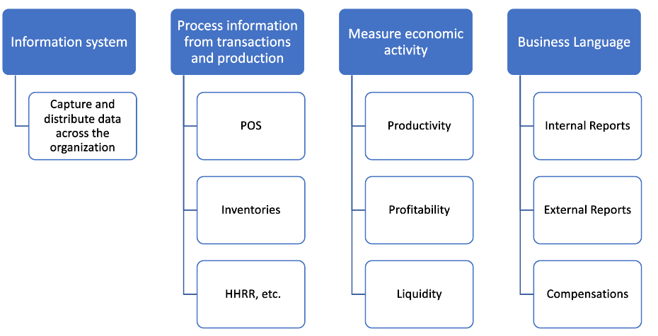
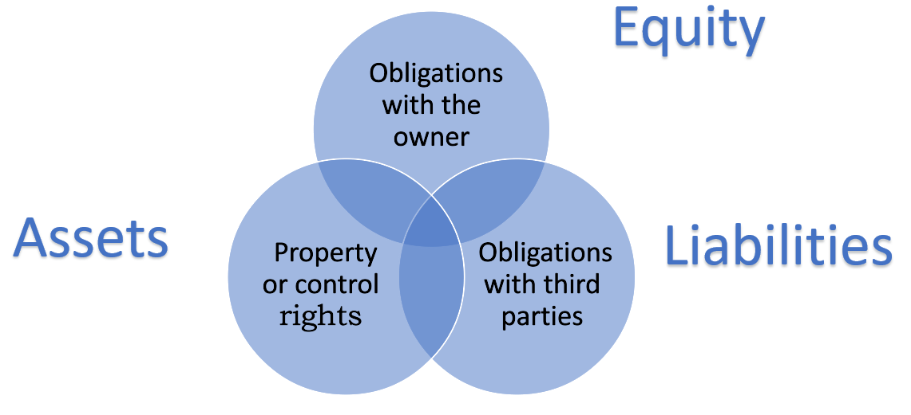
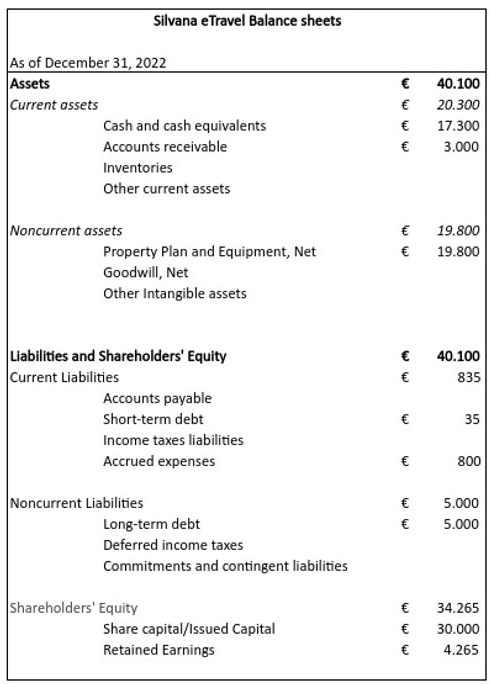
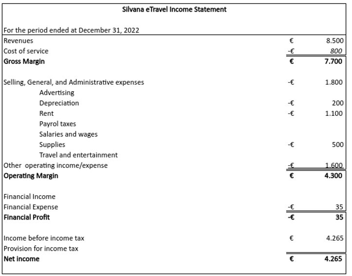
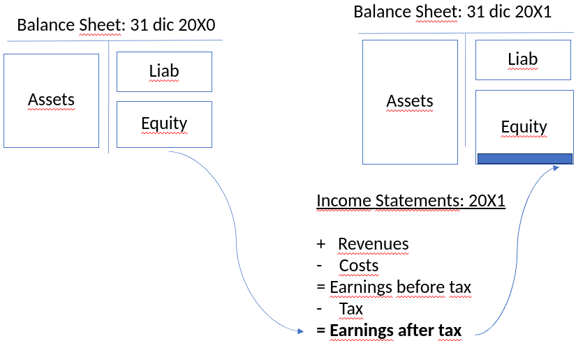

# Accounting Foundations

Marcelo Ortiz

(UPF, BSE, BSM)

---

# Accounting Foundations

1) What is accounting?
2) Transactions as accounting events
3) Basic concepts
4) Accounting equation 
5) Revenue recognition
6) Financial Statements
7) FSA framework
8) Data sources
---
# 1. What is accounting?

---
# 1. What is accounting?

---
# 2. Transactions as accounting events

---
# 2. Transactions as accounting events

What information is important to capture, process, aggregate, and report?
 1. Purchasing merchandize or raw materials
 2. Hiring employees
 3. Contracting a loan
 4. Selling goods or services
 5. Returning goods to suppliers
1. Paying employees

---
# 3. Basic concepts

---
# 3. Basic concepts

Transactions modify specific economic components of the company.

---
# 3. Basic concepts
## 3.1 Assets: Classification
Current Assets
 1. Cash and cash equivalents
 2. Accounts receivable
 3. Inventory
 4. Prepaid expenses
 5. Other current assets

---
Non-current Assets
 1. Long-term investments
 2. Property, plant, and equipment
 3. Intangible assets
 4. Other non-current assets

---
## 3.2 Liabilities: Classification
Current Liabilities
 1. Accounts payable
 3. Accrued expeses
 4. Deferred/unearned revenues
 5. Current portion of Long-term debt
 6. Taxes payable
 7. Other current liabilities

<!--
tax: income, value-added, estate tax, capital gains tax, property tax, etc. all of them due at different times
--->
---
Non-current liabilities
 1. Long-term debt
 2. Deferred income tax
 3. Pension liabilities
 4. Other long-term liabilities
 5. Commitments and contingent liabilities

---
## 3.3 Equity: Classification
- Share capital
  - Common stock
  - Preferred stock
  - Additional paid-in capital
- Retained earnings
- Treasury stock 
- Accumulated other comprehensive income

<!--
Share Capital: The total value of the company's shares that have been issued.
1.1 Common Stock: Equity ownership in a corporation entitles shareholders to vote and potentially receive dividends.
1.2 Preferred Stock: Shares with a higher claim on dividends and assets than common stock but typically no voting rights.
1.3 Additional Paid-in Capital: The excess over par value shareholders have paid for the company's stock.

Retained Earnings: Cumulative net income retained in the business after the distribution of dividends.

Treasury Stock: Shares that a company has repurchased from shareholders and are held in the company's treasury.

Accumulated Other Comprehensive Income: The total unrealized gains and losses on investments and certain foreign currency transactions are not included in net income.
-->

---
# 4. Accounting Equation
---
# 4. Accounting Equation
$$Assets=Liability+Equity$$
- Transactions (or economic events)  modify assets, liabilities, and equity.
- However, always the **accounting equation holds**.
- This equation is the basis of **double-entry accounting.**

---
# 5. Revenue recognition
---
# 5. Revenue recognition

It is the second pillar in accounting. It is the process of recording revenue in the financial statements. When a company records revenues, it must also record expenses. This is the **matching principle**:

1. Recognizing revenue when earned, regardless of when payment is received.
2. Expenses should be matched with revenues they helped to generate in the same period, even if payment occurs later.

---
Therefore it is important to when companies can recognize revenues
 - in 2018, the FASB (ASC 606) and IFRS (IFRS 15) converged into a standard for revenue recognition.
 - The standard is based on the principle that revenue is recognized when the risk and rewards of the goods or services are transferred to the customer.

---
5 steps revenue recognition model:

1. Identify the contract with the customer.
   - clear allocation of rights, obligations and payment terms.
2. Identify the performance obligations in the contract. 
   - distinct goods or services.
3. Determine the transaction price.
   - Long-term contracts: expected value or most likely amount.
   - vs. One-off contracts: fixed amount.  
   - Only if the payment is highly likely to materialize, can the company recognize revenue.
4. Allocate the transaction price to the performance obligations in the contract.
   - Proportional to the stand-alone selling price of each performance obligation.
   - Upfront fees: activation fee, joining fee.
5. Recognize revenue when (or as) the entity satisfies a performance obligation.
   - Over time vs at a point in time.
   - Customer controls the good or already used the service.

---
Example: 

Silvana eTravel SA
Let's apply the accounting equation and matching principle to the following transactions:

---
### Transaction 1: Starting the business
Silvana invested $30,000 of her own money to start the business. ​

She deposits $30,000 in a "Silvana eTravel SA" bank account. 

---
### Transaction 2: Buying an office
Silvana purchases an office, paying $20,000 in cash. ​

Depreciation: $200​

---
### Transaction 3: Buying an office supplies
Silvana buys office supplies, agreeing to pay $500 within 30 days.​

These supplies will last until the end of the year

---
### Transaction 4: Earnings of Service Revenue

Silvana eTravel earns service revenue by providing travel services for clients. ​

She earns $5,500 in revenue and collects this amount in cash.​

The labor cost of providing the service was $600.​

---
### Transaction 5: Revenue on account

Silvana eTravel performs services for clients who do not pay immediately. ​

Silvana receives clients’ promises to pay $3,000 within one month in return for her travel services. ​

The labor cost of the service was $200.​

---

### Transaction 6: Paying expenses

Silvana eTravel during the month pays with cash:​

Office rent, $1,100.​

Web Hosting, $1,200.​

Utilities, $400.​

---

### Transaction 7: Long-term debt

Silvana borrows $5.000 using a bank credit. The first year will pay $35 on interest expenses.

---
# 6. Financial Statements

---
# 6. Financial Statements
## 6.1 Aggregations

Each transaction or economic event requires determining an amount affecting the basic accounting elements.

Some rules help us to define these amounts​.

 - **IFRS**: International Financial Reporting Standards
 - **US GAAP**: Generally Accepted Accounting Principles

Consistency across time and transactions is Key!

---
### Asset valuation
1. **Historical Cost**: Assets are valued at their original cost.
   1. Acquisition cost
   2. Production cost
2. **Amortized cost**: Assets are valued at their original cost minus accumulated depreciation.
3. **Fair Value**: Assets are valued at their current fair value.
   1. Market value
   2. Net realizable value

---
### Liabilities Valuation
1. **PVFP**: Present value of future payments.
2. **Expected PVFP**
3. **Fair Value**: Liabilities are measured at their current fair value.
4. 
### Equity Valuation
1. **Historical Cost**: Retained earnings at original cost.
2. **Revaluation Reserves**: Equity can be revalued to fair value through reserves.
3. **Fair Value through OCI**: Some equity instruments can be valued at fair value through other comprehensive income.

---
## 6.2 Financial Statements: Why?
Once we have **recorded all the transactions using the same rules**, we need to aggregate them to provide helpful information to the users of the financial statements.

Users of financial statements:
1. Investors
2. Creditors
3. Employees
4. Customers
5. Suppliers
6. Governments

... but why do they need financial statements? What are they looking for?

---

1. Growth: is the company growing? How?
2. Profitability: is the company's profit satisfactory?
3. Liquidity: can the company pay its short-term obligations?
4. Solvency: can the company handle its long-term obligations?

---

 Users find the information to answers to these questions in the company's fillings.
- Annual report (**10-K** )
- Quarterly report (**10-Q**)
- Acquisition and disposal of financial assets, changes in company management or corporate governance (**8-K**).
- Information for shareholders to vote on issues related to the company's management (**DEF-14A: Proxy Statement**)
---

Core financial statements:
1. Statement of Financial Position (Balance Sheet)
2. Statement of Comprehensive Income (Income Statement)
3. Cash Flow Statement
4. Statement of Changes in Equity
   
Other sources of information:
1. Notes to the Financial Statements
2. Management's Discussion and Analysis (MD&A)
​
---
## 6.3 Statement of Financial Position 
The balance sheet is a statement that lists what the organization owns (assets), what it owes (liabilities), and what it is worth (equity) on a _specific date_.

---
Some obvious limitations.
- it does not reflect the value of the intangible assets such as human capital, or reputation.​
- information is based on an specific date
- it incorporate various measurement bases: fair value, historical cost, amortized cost, etc.
---
Benefits:

It provides insights about company situation in terms of:
- liquidity
- solvency
- ability to make distributions to shareholders

---
## 6.3 Statement of Comprehensive Income
It has two main components:
- The Income Statements show the financial performance for a _given period_ arising​ from normal business activities.​
- The Other Comprehensive Income (OCI) shows the changes in equity that are not included in the Income Statement but impact owners' equity (e.g., unrealized gains/losses on investments).​

<!--
here explain:
1) difference between revenue and sales
2) difference between revenues and net revenues
3) SGA expenses are not driven by production
4) provision tax= tax expenses
5) Alternative presentations for operating expenses: by function (Apple) by nature (Grifols).
-->

---

---
## 6.3 Cash Flow Statement

The matching principle implies that cash inflows and outflows differ from revenues and expenses.​

Therefore, to understand the company's cash flows, we must prepare a separate statement called the Cash Flow Statement.​

Components:
1. Cash flows from operating activities: main business activities.
2. Cash flows from investing activities: purchase and sale of assets.
3. Cash flows from financing activities: issuance and repayment of debt and equity.

---
## 6.3 Statement of Changes in Equity
How the _Equity_ of an organization has changed over a specified period.​
In general, the focus is on what elements affected the two main components of _Equity_ during the period: _Common Stock_ and _Retained Earnings_.​

Why could other stakeholders be interested in this?​
- Creditors check if the company is reinvesting enough. Each dollar paid as a dividend is a dollar that cannot be paid later on to credits.​
- External investors also see if the company is increasing its capital base. It indicates that current shareholders see growth opportunities that need to be financed.​

---
Components:
1. Beginning balance of equity accounts
2. **Common Stock**/**Subscribed Capital**: + capital increase; - Capital decrease
3. **Retained Earnings**: + net income; - net loss; - dividends
4. Ending balance of equity accounts

---
## 6.4 Dependencies in Financial Statements
1. Cash payments to reduce Trade payables will be reflected in the Balance sheet and Cash Flow Statement.​
2.  Recognizing non-current assets depreciation will be reflected in the Balance sheet and Income Statement.​
3.  Profits of the year will be reflected in the Balance Sheet, Income Statement, and Statement of Changes in Equity.​
4.  Shared capital issued will be reflected in ....

---
## 6.5 Notes to the Financial Statements
 It is the the larges component of the financial report.

 They reveal important information about the company's financial position and performance that would be difficult to discern from the financial statements alone.​

Important Elements:
  1. Basis of preparation: IFRS, US GAAP, etc.
  2. Summary of significant accounting policies: valuation, depreciation, etc.
  3. Management' assumptions and estimates: useful life, etc.
  4. Risk characteristics: credit, liquidity, market, etc.
  5. Contingent liabilities: legal disputes, etc.
  6. Related party transactions: transactions with owners, managers, etc.

---
## 6.6 Management's Discussion and Analysis (MD&A)
It is a section of the annual report that provides management's interpretation of the company's recent performance.​

- Issues related tu current and future operations/performance
- Favorable/unfavorable trends
- Important events and uncertainties
- Explanations of unusual or infrequent events
- Price changes

It is mainly forward-looking information.​

---
# 7. FSA framework
---
# 7.  FSA framework

## 7.1 Context and Process

Financial statements help to evaluate the financial performance and efficiency of the overall company and its different business segments

Managers have an advantage relative to external investors: they can rely on more data and request reports tailored to specific managerial questions. That will be the focus of the Managerial Accounting Sections.​

---
Now, we will study a general framework for financial analysis (meaning using the same data that an external investor would have)
- How is our company growing? Type of assets, funding.​
- Do we need to change our liquidity/solvency policy?​
- Are we using our assets efficiently?​
- What is driving our profits/losses?​
It is not only helpful in evaluating our company (or business unit) but also competitors, suppliers, and customers.

---
### Steps
1) Economic factors:
   1) Unemployment rate
   2) Inflation rate
   3) Interest rates
2) Industry factors:
   1) Industry growth
   2) Industry structure: competition, barriers to entry, etc.
   3) New products or technologies
3) Company factors:
   1) Business model
   2) Long-term plans
   3) Who?

---
## 7.2 Analysis and Metrics

After analyzing the context, we can analyze the company's financial statements.​

1) Comparison across time:​
   - How is the company doing relative to previous years?​
   - What has internally and externally changed?​
     - Internal: new CEO, new products, new production technology.​
     - External: changes in demand, stricter financing conditions.​

2) Comparison within industry peers:​
   - What explains cross-sectional differences?​
   - Different shocks​, efficiencies, innovation, or  new products

---
## Areas of Financial Statement Analysis:
###  1. Credit (Risk) Analysis:
   1.  Liquidity. To evaluate the ability to meet short-term obligations. 
   2.  Capital structure and solvency. To assess the ability to meet long-term obligations. 

### 2. Profitability Analysis: 
   1. Return on investment. To assess financial rewards to the suppliers of equity and debt financing. 
   2. Operating performance. To evaluate profit margins from operating activities. 
   3. Asset utilization. To assess the effectiveness and intensity of assets in generating sales, also called turnover. 

---
###  3. Valuation 
   1. To estimate the intrinsic value of a company (stock).

### Common rules:
- Balance sheet items: Ratios are calculated using average values.​
- Income statement items: Ratios are calculated using year-end values.​
- Cash flow statement items: Ratios are calculated using year-end values.​

---

| Liquidty Ratios        | Formula                                                                     |
|:-----------------------|:----------------------------------------------------------------------------|
| Current Ratio          | Current Assets / Current Liabilities                                        |
| Liquidity Ratio        | (Current Assets - Inventories) / Current Liabilities                        |
| Acid Test              | (Cash + Accounts Receivable + Short-Term Investments) / Current Liabilities |
| Working Capital        | Current Assets - Current Liabilities                                        |
| Collection Period      | Accounts Receivable / (Sales / 365)                                         |
| Days to sell inventory | Inventory / (Cost of Goods Sold / 365)                                      |

---

| Solvency Ratios       | Formula                       |
|:----------------------|:------------------------------|
| Financial Leverage    | Liabilities / Total Assets    |
| Long-Term Debt Ratio  | Long-Term Debt / Total Assets |
| Times Interest Earned | EBIT / Interest Expense       |

---

| Profitability Ratios| Formula                                                                 |
|:--------------------|:------------------------------------------------------------------------|
| Gross Profit Margin | Gross Profit / Sales                                                     |
| Operating Margin    | Operating Income / Sales                                                 |
| Net Profit Margin (return on sales)   | Net Income / Sales                                                       |

| Return on Investment Ratios | Formula                                                   |
|:----------------------------|:----------------------------------------------------------|
| Return on Assets            | [Net Income + interest expense (1-tax rate)] / Total Assets |
| Return on Equity            | Net Income / Total Equity                                 |

---
| Efficiency Ratio    | Formula                                        |
|:--------------------|:-----------------------------------------------|
| PPE Turnover        | Sales / PPE                                    |
| Inventory Turnover  | Cost of Goods Sold / Average Inventory         |
| (1) Days Receivable | (Accounts Receivable / Net Credit Sales) × 365 |
| (2) Days Payable    | (Accounts Payable / Cost of Goods Sold) × 365  |
| (3) Day Stocks      | (Average Inventory / Cost of Goods Sold) × 365 |
| Cash Cycle          | (1)+(2)+(3)                                    |

---
| Valuation             | Formula                                       |
|:----------------------|:----------------------------------------------|
| Price-Earnings Ratio  | Market Price per Share / Earnings per Share   |
| Price-to-Book Ratio   | Market Price per Share / Book Value per Share |
| Dividend Yield        | Dividends per Share / Market Price per Share  |
| Dividend Payout Ratio | Dividends per Share / Earnings per Share      |

---

- For an analysis of a company's financial statements, see the appendix of the slides.
  - It compares Volkswagen and Mercedez-Benz.
  - As many analysts do, they use accounting items "as they are" in the financial statements without adjusting them.
- However, in the first part of this course, we will dig deep and learn how to measure them correctly:
  - Topic 2: Adjustments to represent real financing activity
  - Topic 3: Adjustments to represent real investing activity
  - Topic 4: Adjustments to represent real operating activity

---
# 8. Data sources
---
# 8. Data sources
## 8.1 This course
:mag_right: Let's have a first glance at the financial statements of the companies we will use as examples throughout the course.

|Country|Company|Standard|
|:------|:------|:-------|
|Spain|Grifols|IFRS|
|Spain|Inditex|IFRS|
|Germany|Volkswagen|IFRS|
|Germany|Mercedes-Benz|IFRS|
|USA|Apple|US GAAP|
|USA|Colgate-Palmolive|US GAAP|

---
### USA:
- Background Analysis: Read Item 7.
- Financial Statements: Read Item 8.
  
***Colgate-Palmolive***: search for "Index to Financial Statements" in the 10-K form.

***Apple***: search for "Financial Statements and Supplementary Data in the 10-K form.

### Spain (and most of the EU):
- Background Analysis: read "Directors' (Management) Report."
- Financial Statements: read "Consolidated Annual Accounts."
  
***Grifols***: search for "Balance Sheet" in the 2022 Annual Accounts.

***Inditex***: search for "Sheet" in the 2022 Annual Accounts.

---
## 8.2 Other sources

### Detailed financial statements from regulators
- [SEC](https://www.sec.gov/edgar/searchedgar/companysearch.html): Search for the company name and look for the 10-K form.
  - [Instructions](https://www.investor.gov/introduction-investing/getting-started/researching-investments/using-edgar-research-investments)
- [CNMV](https://www.cnmv.es/portal/home.aspx): Search for the company name and look for the "Annual Accounts" section.  

### (Free) Financial data providers
- [Yahoo Finance](https://finance.yahoo.com/): Search for the company name and look for the "Financials" tab.
- [Google Finance](https://www.google.com/finance): Search for the company name and look for the "Financials" tab.

---
### News and analysis
- [Seeking Alpha](https://seekingalpha.com/)
- [Simply Wall St.](https://simplywall.st/)
---
# Questions :question:
Check my website for an updated version of this presentation:

:point_right: [https://www.marceloortizm.com/](https://www.marceloortizm.com)
# Thanks :clap:

<!--
Pending for next year:
TODO add slides about the reporting environment? Earnings annuncements, voluntary, mandatory, 
--->