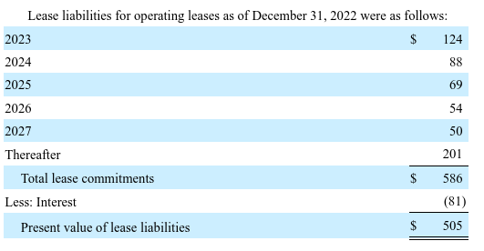
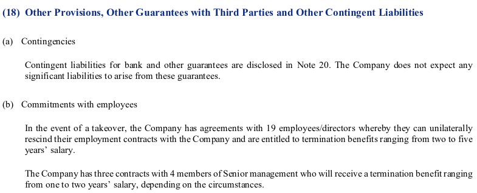

# Analyzing Financing Activities

Marcelo Ortiz

(UPF, BSE, BSM)

---
#  How do financing decisions affect the financial statements :question:

1. Liabilities
2. Leases
3. Contingent liabilities and commitments
4. Off-balance-sheet financing
5. Equity financing

---
# 1. Liabilities

---
# 1. Liabilities
## 1.1 Types of Liabilities 
A. :moneybag: Financing liabilities: all forms of credit financing, such as bank loans, bonds, and leases.

B. :page_with_curl: Operating liabilities: obligations that arise from normal business operations, such as accounts payable, accrued expenses, and taxes payable.

For reporting purposes, liabilities are classified as current or noncurrent, based on whether the obligation is expected to be satisfied within one year or the operating cycle, whichever is longer.

---
# 1.2 Liabilities: Current
  ### Valuation
- Current liabilities are reported at their maturity value, which is the amount that will be paid to satisfy the obligation.
 
 ### Coventants
 - Debt covenants are restrictions imposed by creditors on borrowers to protect the creditors' interests.
 - **Acceleration clause**: in the case of a breach of a debt covenant, the creditor may demand immediate repayment of the debt (reclassification of debt). 
 - Debt/equity ratio, interest coverage ratio, and current ratio are examples of debt covenants.
---
# 1.3 Liabilities: Noncurrent
### Valuation
- Noncurrent liabilities are reported at their present value, which is the amount that will be paid to satisfy the obligation, or at fair value.
- Bond issuance costs are amortized over the life of the bond using the effective interest method: legal fees, underwriting fees, and discounted value (sell price - face or par value).
  
### Reporting
 - Interest rates, maturity dates, conversion privileges, call provisions, and other relevant information about noncurrent liabilities are disclosed in the notes to the financial statements.
---
:mag_right:  Example Apple 2022

Search for "DESCRIPTION OF DEBT SECURITIES" and check:
- type of instrument
- maturities
- interest rates
- ranking/seniority
- redemption
- covenants 

---
## Credit Ratings
 The credit rating of a bond is an assessment of the issuer's ability to make timely payments of interest and principal.

 [S&P](https://www.spglobal.com/ratings/en/about/understanding-credit-ratings)

---
##  Bond valuation and credit ratings
Therefore, it is not surprising that the credit rating of a bond is a major determinant of 
1) the interest rate that the issuer must pay to sell the bond.
2) the fair value of the issued bonds in the market
  
---
## Bond valuation and credit ratings

When credit ratings worsen, it creates income for the company :heavy_exclamation_mark:

1. worse credit rating, lower bond price, lower liability valuation, assets stable at historical cost, higher income.
2. assets - liabilities = equity, higher equity value, higher income.

This problem is more severe when the company has a large amount of debt and a small fraction of assets valued at fair value.

---

# 2. Leases

---

# 2. Leases
## 2.1 Definitions and key elements
- It is a contractual agreement between a **lessor** (owner) and a **lessee** (user) that gives the lessee the right to use an asset owned by the lessor for a specified period of time in exchange for periodic rental payments.
- Payments: minimum lease payments (MLP), contingent rentals, and residual value guarantees.
  - Contingent rentals are payments that depend on the future performance of the leased asset.
  - Residual value guarantees are guarantees that the lessee will pay the lessor a specified amount at the end of the lease term if the residual value of the leased asset is less than the guaranteed amount.

----
## 2.2 Capital vs. Operating Leases
- Capital lease: a lease that transfers substantially all the benefits and risks of ownership to the lessee: new assets and liability
- Operating lease: all other leases: no new assets nor liability, just rental expenses.

Strong incentive to structure leases as operating leases even when they are economically equivalent to capital leases.
- Operating leases are not reported on the balance sheet.
- Off-balance-sheet financing.
- Tax considerations.
---
## An illustrative example
- A company leases an asset on January 1, 2005.
- The company has no other assets or liabilities.
- The estimated economic life of the leased asset is 5 years and no residual value is expected.
- Depreciation is computed using the straight-line method.
- The lease has a fixed noncancelable term of 5 years with MLP of $2,505 per year, payable at the end of each year.
The interest rate on the lease is 8% per year.
---
First, let's compute the present value of the MLP.
Remember that the PV of an annuity is given by $P_0=\frac{1-1/(1+i)^n}{i}$. In this case, $i=8\%$ and $n=5$.
- $P_0=\frac{1-1/(1.08)^5}{0.08}=3.9927$
- Leased asset value = $2.505\times 3.9927=10.000$

Second, compute the interest expense and depreciation expense for each year.

---

| year  | Op. Lease (Rental exp.) | Interest exp. | Dep. exp. | Cap. Lease |
| ----- | ----------------------: | ------------: | --------: | ---------: |
| 2005  |                  $2,505 |          $800 |    $2,000 |     $2,800 |
| 2006  |                   2,505 |           664 |     2,000 |      2,664 |
| 2007  |                   2,505 |           517 |     2,000 |      2,517 |
| 2008  |                   2,505 |           358 |     2,000 |      2,358 |
| 2009  |                   2,505 |           186 |     2,000 |      2,186 |
| Total |                  12,525 |         2,525 |    10,000 |     12,525 |

Total expense is identical for both cases, but the timing is different: capital lease reports more expenses earlier :chart_with_upwards_trend: :vs::chart_with_downwards_trend:

---
-  Almost 1/3 of the Plant Assets are financed by operating leases.
-  Very common in retail, airlines, and other industries.

---
## 2.4 Capital Lease Criteria
1. Ownership of the asset is transferred to the lessee at the end of the lease term.
2. The lease contains a bargain purchase option.
3. The lease term is equal to 75% or more of the estimated economic life of the leased asset.
4. The present value of the minimum lease payments is equal to 90% or more of the fair value of the leased asset.

---
## 2.5 Reporting
-  Capital lease: the lessee recognizes an asset and a liability at the present value of the MLP.
-  Furthermore, lessees have to report leased assets and lease liability for all leases (operating and capital) with a term of more than 12 months.
-  We can find the information in two places:
   -  "Significant/Selected Accounting Policies"->"Leases"
   -  "Notes to the Financial Statements"->"Leases"

---
:mag_right: Example: Colgate-Palmolive 2022 

> ### 15.    Leases.
> Substantially all of the Company’s leases are considered operating leases. Finance leases were not material as of December 31, 2022, and 2021.

---
:mag_right: Example: Grifols 2022

 

---
:mag_right: Example: Inditex 2022

 

---
:mag_right: Example: Inditex 2022

 

---
## 2.6 Impact of Operating Leases on Financial Statements
1. Understate liabilities by keeping lease obligations off the balance sheet. Impact solvency ratios.
1. Understate assets, inflating return on investment and assets turnover ratios.
2. Delay the recognition of expenses, inflating net income and EPS.

Now it should be clear why operating leases are so popular: it positively affects key ratios that are used by investors and creditors to assess the financial health of the company.

---
## 2.7 Converting Operating Leases to Capital Leases
Many analysts and investors try to convert operating leases to capital leases to assess the impact of operating leases on financial statements.

Suggestions: classify only when the lessee's classification appears inconsistent with the economic characteristics of the lease.

---
The following method provides reasonable estimates of the impact of operating leases on the financial statements,  but it does not precisely quantify all the effects of the lease reclassification.

Data from the 2022 annual report of Colgate-Palmolive.

Estimate the length of the remaining period beyond the 5 years disclose in the Notes: $\$201/50=4.02$ years.

Add this length to the 5 years of the 2003-leases: 9.02 years.

---
- Many would argue that a 9-year commitment for operating leases is too long to ignore.
- So, we need to evaluate how much the financial statements would change if we capitalize on the operating leases.

---
## Steps:
1. Estimate interest rate to discount projected lease payments.
    - Trial and error: the interest rate that matches the PV of the MLP and the projected lease payments. Both are disclosed in the Notes.
2. Add the PV of the MLP to the balance sheet as a liability.
   - Identigy the short and long-term portions of the liability.
3. Estimate the value of the operating lease asset.
   - Here more complications arise: economic life, depreciation policy, residual value, etc.
   - For simplicity, we assume that its value equals the PV of the MLP (liability).
4. Income statement: Compute the interest expense and depreciation expense for each year.
---
Let's do it in MS Excel.

---

Conclusion: No red flags. 
-  Operating leases are not severely affecting income statements.
-  Total assets = $15,731,  adj lease asset ($505): 3.2% of total assets.
-  Total liabilities = $14,925, adj lease liability ($505): 3.4% of total liabilities. 		

---
# 3. Commitments and contingent liabilities

---
# 3. Commitments and contingent liabilities
## 3.1 Contingent liabilities

A contingent loss is a potential loss that depends on some future event.

They arise from litigations, threats of expropriation, product warranties, tax assessments, catastrophic losses of properties, etc.

Conditions for recognizing a contingent loss:
   1. It is _probable_ that an asset will be impaired or a liability incurred (i.e., it is likely that an event will confirm the loss).
   2. A _reasonable estimate_ of the loss can be made.

---
If one or both conditions are not met, then the company must disclose the contingency in the Notes when there is at least a _reasonable possibility_ that a loss will occur.

Reported contingent liabilities are based on the company's estimates.
 -  Prior experience or future expectations.
  
Our analysis, then, is limited by the quality of these estimates.

---
Note disclosure should include the following information about contingencies:
1. Nature of the contingency.
2. Degree of uncertainty about the outcome.
3. The possible range of loss.
Of course, it is reasonable to assume that companies will disclose only the information that is favorable to them.

---
Typical examples of contingent liabilities:
-  Litigation: lawsuits, claims, and assessments.
-  Loss reserves: warranties, product recalls, environmental remediation, etc.

Important: loss reserves are not risk-hedging activities. They are contingent liabilities and have no cash flow implications.

---
## 3.2 Commitments
A commitment is a potential claim against a company's resources that depends on some future event under contract.

Key feature: non-complete transactions in accounting terms
signing of an executory contract.
  - issuance of a purchase order.

Frequent commitments: 
- Purchase commitments
- Debt covenant restrictions
- Licensing agreements

---
:mag_right: Example: Grifols 2022

 

---
# 4. Off-balance-sheet financing

---
# 4. Off-balance-sheet financing
It refers to the non-recognition of financing activities in the financial statements.
- Operating leases are the most common example.
- Other examples: special purpose entities, joint ventures, limited partnerships, etc.

---
## 4.1 Joint ventures
A joint venture is a business entity created by two or more parties, generally characterized by shared ownership, shared returns and risks, and shared governance.

Steps
1. The company creates a separate entity and provides financing not exceeding 50% of the total capital.
   - The company does not consolidate the joint venture: it is treated as an investment. 
2. The separate entity borrows money from a bank and uses the money to purchase assets.
3. The separate entity leases the assets to the company.
---
Examples:
-  Avis Rent-A-Car.
-  Oil companies: joint ventures to building and operating pipelines.
---
## 4.2 Special purpose entities (SPEs)
A special purpose entity (SPE) is a legal entity created to fulfill narrow, specific or temporary objectives.
- typically used by companies to isolate the firm from financial risk.
- and for accounting fraud :bomb:
 
---
Steps
1. The company, called "sponsor" forms a separate entity and capitalizes it with equity investment, some of which must be from independent third parties.
2. The SPE issues debt and uses the proceeds to purchase earnings assets from or for the sponsoring company.
3. The cash flow from the earnings assets is used to pay the debt and provide a return to the equity investors.

---
Example 1 Securitization of receivables:

Steps:
1. Companies sell their receivables to SPEs, which issue debt to finance the purchase.
   - :arrow_double_down: Receivables and  :arrow_double_up: Cash
2. SPE collateralizes bonds with receivables.
3. SPE sells the bonds to investors, the proceeds are used to purchase more receivables on an ongoing basis.

---
Example 2 Commitments to purchase assets:
A company needs to fund the construction of a manufacturing plant.

Steps:
1. Companies execute a contract with the SPE to purchase the output of a plant.
2. The SPE issues debt to finance the construction of the plant
   - collateral: contract and the property 
3. SPE fund the construction of the plant with the debt proceeds.

The company obtains the benefit of the plant without recording the debt on its balance sheet.

---
Why SPEs are so popular :question:
1.  They allow companies to obtain lower-cost financing.
   -  As SPEs are restricted to a single purpose, they are less risky than the sponsoring company.
2.  They allow companies to avoid violating debt covenants.
   - if structured properly, the SPE is not consolidated in the sponsoring company's financial statements.

---
:mag_right:  Example: Colgate-Palmolive 2022

> ### Off-Balance Sheet Arrangements
> The Company does not have off-balance sheet financing or unconsolidated special purpose entities.
---
:mag_right:  Example: Inditex

> ### Analysis of contractual obligations and off balance sheet transactions
> The section "Information on the outlook for the Group" outlines the projected execution of investments, mainly in stores, for the next financial year. However, at year-end there were no firm investment commitments of a material amount.
---
# 5. Equity financing

---
# 5. Equity financing
Equity refers to the owners' (shareholders') financing of a company

Commonly viewed as reflecting the claims of owners against the assets of the company.

Typically, holders of equity securities are subordinate to creditors in the event of liquidation.

---

:mag_right:  Example: Colgate-Palmolive 2022

 

---
## 5.1 Capital stock
The capital stock is also known as "share capital," "equity capital," or "paid-up capital."

The capital stock is the total amount of equity capital that a company raises by issuing and selling its shares of common and preferred stock to investors

---
### Components of capital stock
1. Contributed capital
   -  One part is assigned to the par or stated value of capital shares: Common and/or Preferred stock
   -  The remainder is reported as additional paid-in capital (APIC)
2. Treasury stock (buybacks)
    -  The amount of capital stock repurchased by the company.
    -  It reduces both contributed assets and total equity (_contra-equity account_).
    -  Recorded at cost value
---
### Classification of capital stock
1. Preferred stock
   - dividend distribution preferences (usually fixed)
   - liquidation priority
   - convertibility into common stock
   - nonvoting rights
2. Common stock
   - voting rights
   - bear the residual risk and rewards of the company
---
:mag_right: Example: Apple 2022

---
:mag_right: Example: Inditex 2022

---
:mag_right: Example: Grifols 2022

---

Our focus: can we foresee capital stock dilution :question:

Common variations in the capital stock:
-  issuance of new stocks
-  repurchase of stocks
-  conversion of debentures and preferred stocks
-  stock buybacks
-  reverse stock splits
  
---
Less common reasons to keep in mind:
-  Stock options with compensation and bonus plans calling for the issuance of capital stock over some time at fixed prices (i.e., employee stock ownership plan)
-  Commitments to issue capital stock in the future (i.e., stock warrants, or merger agreements) 
  
---

> - S&P 500 companies are expected to have completed $220 billion in buybacks during the fourth quarter of 2022, according to S&P Dow Jones Indices. [...]

> - 2023 should be the first fiscal year with at least $1 trillion in completed S&P 500 company buybacks, according to Howard Silverblatt, senior index analyst at S&P Dow Jones Indices.

---
## 5.2 Retained earnings
Retained earnings are the accumulated earnings of a company that have not been distributed to shareholders as dividends.
They are the primary source of dividend distribution to shareholders.

Covenants can create restrictions on the use of retained earnings.
  - Bond indentures and Loan agreements

---
# Based on:
- Subramanyam, K. R. (2014). Financial statement analysis. McGraw-Hill Education. Chapter 3.
- Steven M. Bragg (2022). IFRS Guidebook. Accounting Tools. Chapters 19 and 29.
- IFRS 16 Leases
- IAS  37 Provisions (IFRS) Contingent Liabilities and Contingent Assets
- IFRS 11 Joint Arrangements

---
# Questions :question:
Check my website for an updated version of this presentation:

:point_right: [https://www.marceloortizm.com/](https://www.marceloortizm.com)
# Thanks :clap: