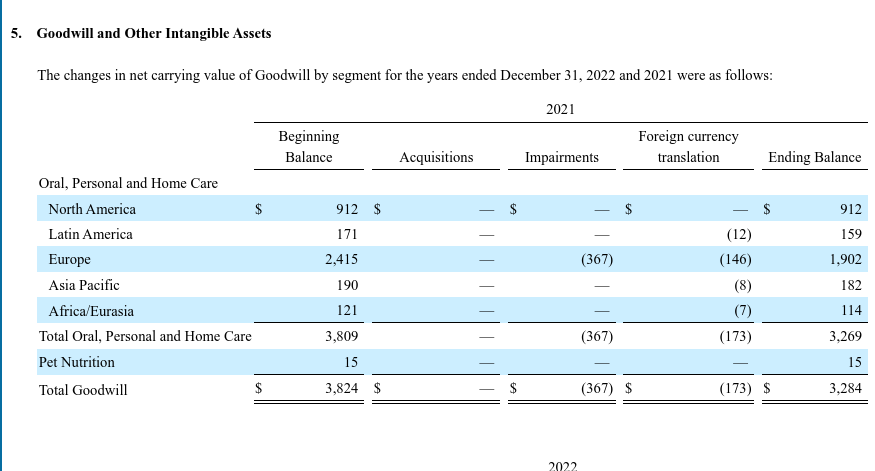

# Analyzing Investing Activities

Marcelo Ortiz

(UPF, BSE, BSM)

---
#  How do investing decisions affect the financial statements:question:

1. Cash and cash equivalents
2. Receivables and collection risk
3. Inventory methods and inflation
4. Long-term assets and capitalization
5. Intangible assets and goodwill
6. Asset revaluations under IFRS

<!--
consider to include
- prepaid expenses
- deferred taxes
- inventories: from fifo to lifo
-->
---
# 1. Cash and cash equivalents

<!--
focus here: 
- is the company managing its cash efficiently?
- does the company hold more lazy cash than what the balance sheet reports?
-->

---
# 1. Cash and cash equivalents
Basic definitions:
- Cash: currency available and money in the bank.
- Cash equivalents: short-term, highly liquid investments that are readily convertible to known amounts of cash and subject to an insignificant risk of changes in value.

---
## 1.1 Analyzing Cash and Cash Equivalents
The focus is determining whether the company has enough cash to meet its obligations and take advantage of opportunities, but it is not sitting on too much cash that could be distributed to shareholders or invested in other projects.

An efficient cash management balances multiple uses of cash:
  - Meet current obligations
  - Take advantage of investment opportunities
  - Pay dividends
  - Hedge adverse shocks (risk management)

---
How to identify lazy cash management?
- High cash balances relative to peers
- More cash equivalents than cash without further explanation
- Cash does not fluctuate symmetrically (it is never spent)

---
## 1.2 Restricted cash
Caution: companies might have more cash than the amount reported in the balance sheet: **Restricted cash** (cash that is not available for general use).
- Covenant restrictions: Sometimes cash is restricted because it is used as collateral for debt (e.g., Ebay needed to hold $126 million in cash as collateral for debt, out of $400 million in cash).
  
---
:mag_right: Example Apple 2022 [5 min]
1) Search: Balance sheet: cash and cash equivalents
2) Search: Note 3 - Financial Instruments

- How much cash does Apple have?
- How is it invested?
- How much is restricted? What is the reason/nature of restrictions?

---

<!--

Notice how the 38K of cash (column 5) is invested in securities. This is a common practice to earn some interest on the cash. However, the cash is still reported as cash in the balance sheet.

Discuss also the distribution of 52K in current marketable securities.

just a really small amount of cash is restricted

---
-->
:mag_right: Example Inditex 2022

---
# 2 Receivables and collection risk

<!--
focus here:
- the risk on growing sales based on a rise of credit sales
- 2009 housing bubble and the risk of credit sales
- very difficult to assess the risk of credit sales
--->
---
# 2 Receivables and collection risk
Basic definitions:

- Accounts receivable: amounts owed by customers for goods or services sold on credit

- Note receivable: a formal written promise to receive a specific amount of money at a future date

- Others: interest receivable, taxes receivable, receivables from affiliated companies

[Appendix: How do new credit sales impact the financial statements?](./topic_3_investing.html#62)

---
### 2.1 Valuation of receivables
The valuation of receivables has two impacts on financial statements:       
  1) Current assets: net receivables 
  2) Operating expenses: bad debt expense

Companies do not collect 100% of their receivables:exclamation:
- Thus, Receivables are recorded at their _Net Realizable Value_ (NRV), which is the amount of cash the firm expects to collect
  - NRV: total receivables - allowance for uncollectable accounts
    - Uncollectable accounts are estimated and reported as a deduction of receivables
    - The expected loss is reported as _Bad Debt Expense_ (operating expense)
  
 --- 
### 2.2 Analyzing receivables
- Is there any error or arbitrariness in estimating the allowance for uncollectable accounts?
- Managers' incentives to overstate or understate the allowance for uncollectable accounts
- Bad news: information to assess collection risk for receivables is not included in the financial statements. Thus, we need to look for other sources of information:
  - Peer's receivables as a percentage of sales
  - Customer concentration risk
  - Average collection period

---
:mag_right: Example Apple 2022 [5 min]
1) Search: Balance sheet: accounts receivable, net
2) Search: Note 3 - Financial Instruments

- How much are the receivables?
- What type of receivables are reported?
- How much is the allowance for doubtful accounts?
---
:mag_right: Example Grifols 2022 (Note 14)

<!--
Notice that most of the receivables are from its business group, not customers. This is a common practice in the pharmaceutical industry.
-->
---
### 2.3 Securitization or Factoring of receivables
- Receivables can be sold to a third party (bank, financial institution, etc.) in exchange for cash
- The third party usually pays less than the face value of the receivables and finances the purchase by issuing debt to the capital markets.
- The collection of those receivables provides the cash flow to pay the debt
- Should the factored receivables be reported as assets :question:
  - Receivables can be kept off the balance sheet if the company surrenders all control over the receivables to an independent buyer.
  - If the company has any degree of retained interest in the receivables, they should be reported as an asset.
  
---
### Example: Factoring of receivables
Syntex 	Co. securitizes its entire receivables of $400 million with no recourse by selling the portfolio to a trust that finances the purchase by selling bonds. Evaluate three scenarios
1. Before securitization
2. After securitization with off-balance financing (as reported under US GAAP and IFRS)
3. After securitization but reflecting the securitization as a borrowing (analyst’s adjustment)

<!--
---
### Consolidation rules
The consolidation rules regarding SPEs (Special Purpose Entities) are complex and are out of the scope of the course. The following normative are currently in place:

[SFAS 104](https://fasb.org/Page/ShowPdf?path=fas140.pdf&title=FAS+140+%28AS+ISSUED%29&acceptedDisclaimer=true&Submit=)

[FIN 46R](https://fasb.org/Page/ShowPdf?path=fin+46R.pdf&title=FIN+46%28R%29+%28AS+ISSUED%29&acceptedDisclaimer=true&Submit=)
-->
---
# 3. Inventory methods and inflation

<!--
the focus here
1) accounting inventory methods have a clear impact on profitabity
2)  People tend to think that operating expenses increased when production increases. However, this is not the case. The costs are hidden in the inventory.
-->

---   
# 3. Inventory methods and inflation
Basic definition:
- Inventory: goods held for sale in the ordinary course of business or goods that will be used in the production of goods to be sold.
  
The valuation of inventories has two impacts on financial statements:  
  1. Current assets: inventory (historical acquisition cost).
  2. Then, as the inventory is sold, these costs are removed from the balance sheet and flow to the income statement as _Cost Of Good Sold_ (COGS).

---
## 3.1 Inventory methods
Assume that the following reflects the inventory records of a company:
 
|Date|Units|Unit Cost|Total Cost|
|---|---|---|---|
|Jan 1|40|$500|$20,000|
|Purchase during year|60|$600|$36,000|
|Total COGS|100||$56,000|

Now assume that 30 units are sold at $800 each. What is the gross profit under each method?

---
Case 1: First-in, first-out (FIFO).
- The first units purchased are the first units sold.

|Method| FIFO|
|---|---|
|Sales| $24.000|
|COGS (30 @ 500)| $15.000|
|Gross Profit| $9.000|

In the balance sheet at the end of the period, the inventory is reported at $41.000 ($56.000-$15.000).

--- 
Case 2: Last-in, first-out (LIFO).
- The last units purchased are the first units sold.
  
|Method| LIFO|
|---|---|
|Sales| $24.000|
|COGS (30 @ 600)| $18.000|
|Gross Profit| $6.000|

In the balance sheet at the end of the period, the inventory is reported at $38.000 ($56.000-$18.000).

Important: LIFO is not allowed in IFRS:exclamation: why:question: mainly because it delays or reduces the payment of taxes. 

---
Case 3: Average cost
- The weighted average cost of all units is used to determine COGS.

|Method| Average|
|---|---|
|Sales| $24.000|
|COGS (30 @ 560)| $16.800|
|Gross Profit| $7.200|

In the balance sheet at the end of the period, the inventory is reported at $39.200 (70 units @ $560)

---
The impact of inflation on financial statements via inventory methods:
- Profitability: FIFO results in higher gross profit than LIFO when input prices are rising.
- Balance sheet: FIFO results in higher inventory than LIFO when input prices are rising
- Cash flows: liquidity squeeze under FIFO when input prices are rising.
  - More profit implies more (cash) tax payments.
  - Inventory needs to be replaced at a replacement cost higher than the original costs. This can be a severe problem in high inflation environments such as Argentina in the 80s and 90s or the US in the 70s.
---
## 3.2 Lower of cost or market (LCM)
So far we have focused only on historical cost.

However, the generally accepted principle of inventory valuation requires that inventory be reported at the lower value between the cost and the market value.

The LCM rule is applied when the market value of inventory is lower than its cost. 

Reasons:
- obsolete inventory
- damaged inventory
- price changes
---
Procedure:
1. Determine the market value of the inventory.
2. Compare the market value with the cost in the Balance Sheet.
3. Write down the inventory to the lower of cost or market value.
4. This write-down is charged against revenues in the period the loss occurs.

Write-ups are not allowed under US GAAP and IFRS.

---
## 3.3 Inventory costing for Manufacturing companies
- Manufacturing companies have three types of inventories:
  - Raw materials: materials that will be used in the production process.
  - Work-in-process: goods that are in the process of being manufactured
  - Finished goods: goods that are ready for sale.

---
The main components of the cost of inventories are:
- Direct materials: materials that are an integral part of the finished product and whose costs can be traced to the finished product.
- Direct Labor: labor costs that can be traced to the finished product.
- Overhead: indirect costs that cannot be traced to the finished product.
  - depreciation of manufacturing equipment, supervisory wages, utilities, etc.

The distribution of these costs brings some information about what management is forecasting about the future demand for the product.

---
As the production level increases, more overhead cost is allocated to all units produced.  

Instead of expensing these costs as period expenses, they are included in the cost of inventories and remain on the balance sheet until the inventory is sold:exclamation:

**Takeaway: Profitability is overstated when production increases because part of the cost of inventories is not expensed in the period in which it is incurred.**

<!--
develop this takeaway intuitively: 
- what happen with the production costs when production increases?
- where is the increased cost being hidden?
- what happens with the income statement?
-->

---
:mag_right: Example Apple 2010 [5 min]
 1) check the balance sheet: inventory
 2) Search "Note 1: Summary of Significant Accounting Policies" and go to inventory

- How much is the inventory? What method is used?

---
:mag_right: Example Colgate 2022

---
:mag_right: Example Grifols 2022

---

# 4. Long-term assets and capitalization

<!--
focus:
- what is the impact of investing in long-term assets?
- what happen when the assets valuation changes?
--->

---
# 4. Long-term assets and capitalization
## 4.1 Capitalization and Allocation 

Capitalization: the cost of an asset is recorded as an asset rather than an expense
- Hard assets, such as PPE: assets recorded at cost (purchase price + all costs necessary to get the asset ready for use)
- Soft assets, such as R&D, advertising, and wages. Here, the capitalization is more complicated.
    -  They are investments that will likely generate future benefits, but
    -  No clear useful life, nor clear future benefits
    -  Therefore, these costs are immediately expensed and are not recorded as an asset in the Balance Sheet

---
Allocation: is the assignment of the cost of an asset as an expense over its useful life
- Depreciation: tangible asset
- Amortization: intangible asset

Allocation is not a valuation process. It is a way to match the cost of an asset with the revenues it generates:exclamation:

---
### Depreciation methods

-  Useful life: physical deterioration, technological obsolescence, legal life
-  Salvage value: expected value of the asset at the end of its useful life
-  Allocation method: straight-line, accelerated, or units of production
-  Managers decide which method to use at the time of acquisition
  
---
Example  
The purchase of a new machine has the following characteristics:
- Purchase price: $800,000
- Estimated residual value: $50,000
- Expected useful life: 5 years
- total production capacity: 100,000 units (15,000 units in year 1 and 23,000 units in year 2)

What is the carrying amount of the machine after two years if the company uses the straight-line method?  
How much depreciation expense is recorded in the income statement in year 2?

---

Solution:

- Annual depreciation= (800,000-50,000)/5= $150,000  
- Carrying amount after two years= 800,000-2*150,000= $500,000

How does the solution change if the company uses the units of production method?

- Depreciation per unit: 7.5 euros per unit.
- Depreciation in year 1: 7.5*15,000= $112,500
- Depreciation in year 2: 7.5*23,000= $172,500
- carrying amount after 2 years: 800,000-112,500-172,500= $515,000

<!--
---
### Depletion
- Depletion is the allocation of the cost of natural resources based on the unit exploitation of natural resources like coal, oil, gas, etc.
- Thus, depletion depends on the production level
---> 
---
### Impact on the financial statements
In sum, investing will have three impacts on the financial statements:
1) Balance sheet: + long-term assets and funding (+ debt or - cash).
2) Income statement: + depreciation expense.
   - Capitalization leads to higher and stable net income in the short term.
   - Lumpy investments are smoothed out over time to match the cost of the asset with the revenues it generates.
3) Operating Cash flows: When asset costs are capitalized, they are reported as _investing cash outflows_. (In contrast, if they were expensed, they are reported as _operating cash outflows_).

---
:mag_right: Example Apple 2010 [5 min]
 1) Check the balance sheet: Property, plant and equipment, Net
 2) Search "Note 1: Summary of Significant Accounting Policies" and go to "Property, Plant and Equipment"
 3) Search "Note 4 – Consolidated Financial Statement Details" and go to "Property, Plant and Equipment, Net"

- How much PPE? How it is distributed among assets?
- What method is used to depreciate PPE? Expected useful life?
- How much have already being depreciated? Average residual life?
---
:mag_right: Example Grifols 2022

---
## 4.2 Impairments
Impairment: is the write-down of an asset to its fair value when its carrying value exceeds its fair value. [IFRS IAS 36](https://www.ifrs.org/issued-standards/list-of-standards/ias-36-impairment-of-assets/).
- Recoverable amount. The higher of:
  - Fair value less cost to sell
  - Value-in-use.
- Carrying value: cost of the asset less accumulated depreciation.

---
Example (Under IFRS)
Barceloneta Inc. reports under IFRS, and its manager has collected the following information about a set of assets tested for impairment:
- Carrying value: 35 million euros
- Fair value: 28 million euros
- Selling costs: 1.5 million euros
- PV of expected future cash flows (disc.): 33 million euros
- Total value of expected future cash flows (no disc.) 35.5 million euros

What is the amount of the impairment loss?

---
Solution:
- Carrying value? 35 million euros.
- Recoverable amount?
  - FV - selling costs = 28 - 1.5 = 26.5 million euros.
  - Value-in-use = 33 million euros.
- 2 million euros (35 - 33) is the impairment loss.
 
Impacts on financial statements:  
1) The carrying value of the asset is reduced to 33 million euros (- 2 million assets).
2) 2 million euros is recognized as a loss in the income statement.
    - "Other Income Expenses" in "Operating profit."
---
Example (Under US GAAP)

Solution:
US GAAP is a bit more tricky. The impairment loss is recognized if the carrying value exceeds the undiscounted expected future cash flows.

If that is the case, the impairment loss is the difference between the asset's carrying value and the fair value.

- carrying value: 35 million euros
- undiscounted cash flows: 35.5 million euros

Therefore, no impairment loss is recognized under US GAAP
  
---
# 5. Intangible assets and goodwill
---
# 5. Intangible assets and goodwill

Definition: Intangible assets are long-term assets that have no physical substance but are valued based on the rights or privileges granted to the company using them. This value, however, is not easy to determine: too much uncertainty
- Patents
- Copyright
- Trademarks
- Exploration rights
- Licenses and franchises
- Goodwill
---
## 5.1 Accounting for intangible assets

Incorporation/Generation of intangible assets
- Purchased intangible assets are recorded at historical cost
- Internally generated intangible assets are expensed as incurred
  - R&D cost (at least in the US and R in most of Europe)
  - Why? Accounting conservatism: too much uncertainty about the future benefits of these assets
- Exceptions: Software development costs are capitalized, also some identifiable intangible assets such as patents, trademarks, etc.
  - The capitalized costs of these cases may include legal fees, design and testing costs, registration fees, and other direct expenditures

---
Carrying value of intangible assets:

a) Finite useful life: amortization

  - Amortization: the allocation of the cost of an intangible asset over its useful life

b) Indefinite useful life: no amortization 
  - Impairment test at least annually
  - min{Carrying value, PV of expected future cash flows}

---
Example

This year our company registered a Trademark with a cost $1,000,000 and it has an indefinite useful life. 

What is the carrying value of the Trademark in the balance sheet at the end of the year?

Scenario|Carrying Value|Fair value|Impairment Loss|
|---|---|---|---|
|A|100,000,000|1,200,000|-|
|B|100,000,000|800,000|200,000|

Therefore, in scenario B the carrying value of the Trademark is 800,000.

---
## 5.2 Goodwill
Definition: Goodwill is the excess of the purchase price over the fair value of the net assets acquired in a business combination. [IFRS IFRS 3](https://www.ifrs.org/issued-standards/list-of-standards/ifrs-3-business-combinations/)

- Goodwill is an intangible asset with an indefinite useful life
- Goodwill is not amortized but tested for impairment at least annually
  
Example: your company purchases at $7 million a company with assets fair value of $6 million. The excess of $1 million is recorded as goodwill.

 Why to pay more?
- Assets such as reputation, know-how, customer relationships, etc. are not recorded in the balance sheet
- Synergies: the value of the combined company is higher than the sum of the parts

---
<!--
Explain that we dont do Apple because this company does not report intangible
-->
:mag_right: Example Colgate 2022 (Note 5)

---

---
 :mag_right: Colgate's 10-K, item 7 "Management's Discussion and Analysis of Financial Condition and Results of Operations"
 
> ### Goodwill and Intangible Assets Impairment Charges

> In the fourth quarter of 2022, the Company made revisions to the internal forecasts relating to its Filorga reporting unit due primarily to the continued impact of the COVID-19 pandemic [...]. The Company concluded that the changes in circumstances in this reporting unit [...] triggered the need for an interim **impairment review of its indefinite-lived trademark, goodwill and long-lived assets** which consists primarily of customer relationships. As a result of (...) the Company concluded that the carrying value of the trademark and customer relationships exceeded their estimated fair value and recorded impairment charges of $300 and $89, respectively, reducing their carrying values to $257 and $118, respectively, as of December 31, 2022. 

---
# 6. Asset revaluations under IFRS
---
# 6. Asset revaluations under IFRS
Under IFRS, companies can write up their assets to fair value
  - This departs from a long-held tradition of LCM

Scenarios:

- A. reversal of prior impairment as long as the write-up does not exceed the depreciated historical cost of the asset. [IFRS IAS 36](https://www.grantthornton.global/en/insights/articles/IFRS-ias-36/ifrs-Reversing-impairment-losses/)
      
    - E.g., markets could reverse earlier declines in the value of the asset
    
    - this increases gains in the Income Statement and the net value of the asset and retained earnings in the Balance Sheet

--- 
Scenarios:
 
 - B. creation of revaluation surplus [IFRS IAS 16](https://www.ifrs.org/issued-standards/list-of-standards/ias-16-property-plant-and-equipment/)
    
    - in this case, the company decides to estimate the fair value for all the assets in a class periodically and write up/down to reflect the current fair value
    - if the fair value is above historical cost, the difference is recorded as a revaluation surplus in the equity section of the Balance Sheet (and not in the income statement:exclamation:)
    - depreciation: only the historical cost, not the revaluation surplus
    - the method stops when the fair value is equal to the historical cost

---
Example revaluation method (1):

Millan Manufacturing is located in Spain and reports under IFRS. The company uses a revaluation model to account for its land and buildings.
- January 1, 2020: Millan purchased a plot of land for €3,000,000. 
- December 31, 2020: the fair value of the land is €3,500,000.
- December 31, 2021: the fair value of the land is €2,800,000.

Evaluate how the revaluation model impacts the financial statements of Millan Manufacturing in 2020 and 2021.

---
Example revaluation method (2):

Millan Manufacturing is located in Spain and reports under IFRS. The company uses a revaluation model to account for its land and buildings.
- January 1, 2020: Millan purchased a plot of land for €3,000,000. 
- December 31, 2020: the fair value of the land is €2,600,000.
- December 31, 2021: the fair value of the land is €3,300,000.

Evaluate how the revaluation model impacts the financial statements of Millan Manufacturing in 2020 and 2021.

---
# Based on:
- Subramanyam, K. R. (2014). Financial statement analysis. McGraw-Hill Education. Chapter 4.
- Steven M. Bragg (2022). IFRS Guidebook. Accounting Tools. Chapters 13-16.
- IAS 2 Inventories.
- IAS 16 Property, Plant and Equipment.
- IAS 36 Impairment of Assets.
- IAS 38 Intangible Assets.
---
# Questions :question:
Check my website for updated versions of this presentation:

:point_right: [https://www.marceloortizm.com/](https://www.marceloortizm.com)
# Thanks :clap:

---
# Appendix
### Receivables: accounting and reporting

Nov 1. Company A sells goods worth $1,000 on credit to customers. The company expects to collect the money in 90 days but estimates that 5% of the credit sales will be uncollectible. What is the impact on the financial statements in that year?

|  | Effect |
| --- | --- |
| 1) Balance Sheet | Receivables: +1,000 |
|  | Allowance for doubtful accounts:  +50 |
| 2) Income Statement | Sales revenue: +1,000 |
| | Bad debt expense: +50 |
| 3) CF Statement | No impact|
---
Scenario 1) Customers end up not paying back 20% of the credit sales. What is the impact on the financial statements of Company A for the next year? (ignore the impact of the fraction of the credit sales that are paid back)

|  | Effect |
| --- | --- |
| 1) Balance Sheet | Receivables: |
|  | Allowance for doubtful accounts:  +150 |
| 2) Income Statement | Sales revenue:  |
| | Bad debt expense: +150 |
| 3) CF Statement | No impact|

<!--
this scenario could happen at least in two ways:
1) manager overestimated the fraction of credit sales that will be paid back
2) the economy is in a recession and customers are not able to pay back
-->
---
Scenario 2) Customers end up paying 100% of the credit sales. What is the impact on the financial statements of Company A for the next year?

|  | Effect |
| --- | --- |
| 1) Balance Sheet | Receivables: -1,000 |
| | Cash: +1,000 |
|  | Allowance for doubtful accounts: -50 |
| 2) Income Statement | Sales revenue:  |
| | Bad debt expense: -50 |
| 3) CF Statement | CFO: +1,000|