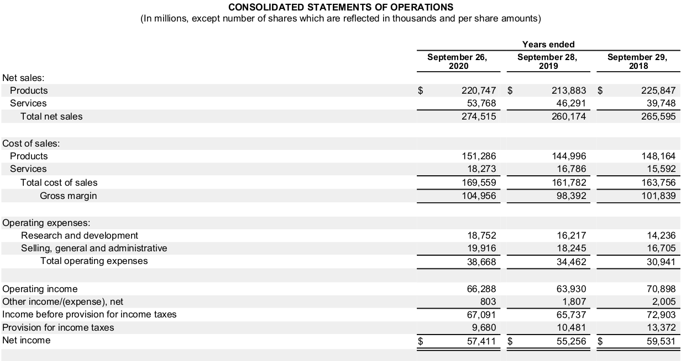
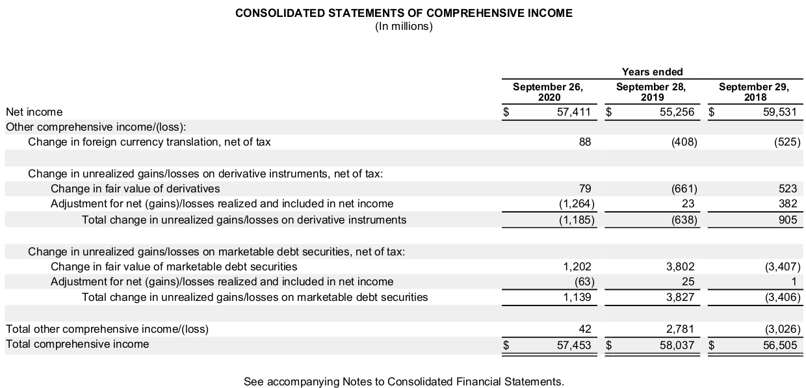
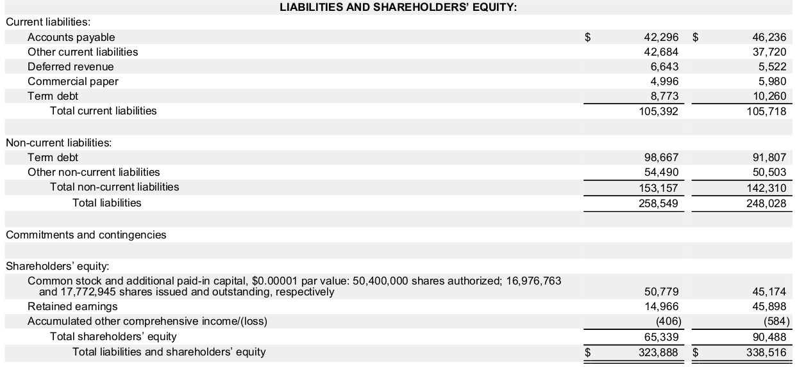

# Analyzing Operating Activities

Marcelo Ortiz

(UPF, BSE, BSM)

---
#  How do operating decisions affect the financial statements:question:

1. Accounting Income measurement
2. Nonrecurring items
3. Deferred charges
4. Income taxes
5. Earnings per share

---
# 1. Accounting  Income measurement
---
# 1. Accounting Income measurement
Two main concepts behind income measurement:
1) **Economic income** measures the _net change in shareholders’ wealth_ during a period. Theoretically, it is equal to a period’s cash flows plus change in present value of expected future cash flows
2) **Recurrent income** is an estimate of the _stable average income that a business is expected to earn_ over its lifetime, given the current state of its business 
   - Also called sustainable income or permanent income
---
**Accounging income** is based on accrual accounting and is determined by recognizing revenues and matching costs to the recognized revenues. 
- Accounting income purports to measure neither economic income nor recurring income. 
- Also called reported income or book income
- Accounting income has measurement error

---
## 1.1 Elements of accounting income

a) recurring income: each :euro: is equal to $1/r$ euros of company value, with $r$ is cost of capital

b) transitory income: each :euro: is equal to one dolar of company value
  - notice that this is less than the permament income
  
c) value irrelevant component: irrelevant to the value of the company

---

When analyzing financial statements, we should try to identify the recurring income component.

Accounting standards provide some guidance on how to identify recurring income:
- the line items on the income statement are arranged in a manner that allows an analyst to identify recurring and nonrecurring components of income
  
Common misconceptions: a majority of operating income components tend to be recurring, but not always:
  - loss of inventory from fire --> nonrecurring operating loss
  - interest earned --> recurring and nonoperating income
  

---
## 1.2 Measuring accounting income
### Revenues and Gains
- similarities: earned inflows of cash or promises to receive cash from customers in the future
- differences: revenues are earned from the company’s ongoing operations, whereas gains are earned from peripheral or incidental activities (not expected to persist)

---
### Expenses and Losses
- Expenses are incurred outflows, prospective outflows, or allocations of past outflows of cash that arise from a company’s ongoing business operations
-  Losses are decreases in a company’s net assets arising from peripheral or incidental operations of a company

---
### Income from continuing operations
- It is a common intermediate measure of income
- it excludes certain nonrecurring items, such as *extraordinary items*, and the effects of discontinued operations, from net income.
- Also called *income before extraordinary items*, or *income before discontinued operations*
- Companies without nonrecurring components will **not report** income from continuing operations because it is equal to net income.
- pre-tax and after-tax separation
---
### Net income
- Net income is the sum of income from continuing operations and nonrecurring items
- Net income is the most widely reported measure of income
- But it **excludes unrealized (holding) gains and losses** that arise because of changes in the value of assets and liabilities that are reflected on the balance sheet
  - i.e., changes in the value of nonspeculative investment securities held by the company

---
### Comprehensive income
- Reflects nearly all changes in the value of equity
  - excluding changes driven by dividends and share issuances
- Comprehensive income is the bottom-line measure of income: best proxy for economic income
- It is most commonly found in the statement of changes in equity, and not as a part of the income statement

---
Components of comprehensive income:
1. Net income
1. Other comprehensive income:
   1. Unrealized gains or losses that result from changes in the fair value available-for-sale investment securities
   2. Unrealized gains or losses arising from the effective portion of cash flow hedges (derivatives); 
   3. Foreign currency translation gains and losses
   4. Changes in the funded status of postretirement benefits not included in net income
   5. (IFRS) revaluations of operating assets to their fair values

<!--
Statement of Changes in equity is linked to the statement of comprehensive income
1) issued shared capital
2) dividend payment
3) net income
4) other comprehensive income
-->
---
 :mag_right:  Example Apple 2022
 
 

---
 :mag_right:  Example Apple 2022
 
 

---
### Accounting of comprehensive income:
- Included in shareholders' equity (balance sheet)
- Not in retained earnings :exclamation:
  - reported in a separate component of shareholders’ equity called *accumulated other comprehensive income (AOCI)*

---
:mag_right: Example: Apple 2022

---
- when the unrealized gain or loss is realized, it is reclassified from AOCI to net income
  - i.e., when the investment security is sold, two things are accounted:
  - 1. the unrealized gain or loss is reclassified from AOCI to net income
  - 2. previously recognized unrealized gain or loss is reversed through a *reclassification adjustment* to avoid doible counting

---
### Analysis of accounting income:
So, what is the correct way to analyze income:question:

A huge debate about what lines should be included (excluded) when measureing income.
- firm valuation? Some analysts prefer to use income from continuing operations because of its (pseudo) recurring nature. Others prefer net income plus some adjustments.
- measure of net change in equity (or economic income)? Comprehensive income.

Important: all these measures are subjects to accounting distortions and errors

---

# 2. Nonrecurring items

<!--
eg, disctontinued operations, extraordinary items, accounting changes, special items, etc.
-->

---

# 2. Nonrecurring items

## 2.1 Extraordinary items
Extraordinary items are events and transactions that are both unusual in nature and infrequent in occurrence: loss of inventory from fire, restructuring costs, litigation charges
- unusual in nature: high degree of abnormality and unrelated to the ordinary and typical activities of the company
- infrequent ocurrence: not reasonably expected to recur in the foreseeable future
Extraordinary items are reported net of tax after continuing income.
<!--
Before 2015: extraordinary items were reported net of tax after continuing income.
After 2018: extraordinary items are not reported in the income statement, but in the footnotes and MDA.
--->
---
### Analysis of extraoriary items:
- Extraordinary items are not expected to recur, so they are not relevant to the valuation of the company
- but they are fully accounted when computing economic income
- typically they are excluded from income when comparing firms or analyzing trends 

---
# 2. Nonrecurring items
## 2.2 Discontinued operations
Companies sometimes dispose of entire divisions or product lines. 

When these dispositions pertain to separately identifiable business components, they are called discontinued operations. 

Discontinued operations are separately reported on the income statement and the balance sheet

---
### Accounting for discontinued operations:

 - The standard is set in US GAAP (ASC 225) and [IFRS 5](https://www.ifrs.org/issued-standards/list-of-standards/ifrs-5-non-current-assets-held-for-sale-and-discontinued-operations/)

 - Req: the operations and cash-flows of the divested business component must be distinguished from those of the continuing operations

- First: restating past 2 years of income statement excluding the discontinued operations

- Second: effects of the discontinued operations are reported separately, net of tax, below income from continuing operations.
  - (US GAAP) (1) income or loss from discontinued operations, (2) gain or loss on disposal

- Balance sheet: assets (liab.) that relate to discontinued operations are segregated and shown separately as assets (liab.) held for disposal.
---
### Analysis of discontinued operations:
- Discontinued operations are not expected to recur, so they are not relevant for determining economic or permanent income or in determining operating or nonoperating income
- The adjustment is straightforward
  -  for the current and past two years because companies are required to restate their income statements, reporting the income of discontinued operations separately.
  -  Amounts for assets and liabilities are typically provided in footnote disclosures.
  
<!-- TODO  bring some examples of disclosures-->  

---
# 2. Nonrecurring items
## 2.3 Accounting changes
Managers may change accounting methods or estimates for a variety of reasons, including:
- to manage earnings
- adopt new accounting standards
- to better reflect changing in business conditions

Of course, accounting regulations discourage managers from applying unjustified changes in accounting methods or estimates 
<!--
Discuss: Falabella case
--->
---
###  Types of accounting changes
1. Change in accounting principle
e.g., change from LIFO to FIFO in inventory accounting, or from straight-line to accelerated depreciation

Importantly, application of the changed principle should be reported retrospectively

This means that all current and prior period information in the income statement and balance sheet will reflect the effects of the new principle

---
###  Types of accounting changes
2. Change in accounting estimate
e.g., change in the estimated useful life of a depreciable asset, inventory obsolescence, uncollectible accounts receivable, warranty obligations, etc.
- If managers update their beliefs about the future, they should update their estimates: economic crisis and allowance of doubtful accounts

<!-- 
By their very nature, the estimates are approximations of unknown future conditions, so it is not surprising that they are subject to change
-->
The change should be reflected in the financial statements prospectively (so no restatement of prior periods is required)

However, the effects should be disclosed in the footnotes to the financial statements

---
### Analysis of accounting changes:

In both cases (principle and estimate), the analyst must consider that the accounting changes yield no cash flow consequences either present or future. 

But this does not mean that the changes are irrelevant or mere cosmetics: sometimes they are used to manage earnings or can reflect new economic reality

Furthermore, the changes can affect the comparability of financial statements across time periods even withim the same company

---
# 2. Nonrecurring items
## 2.4 Special items
Transactions and events that are unusual or infrequent but not both.

Reported in a separete line item on the income statement, as part of *income from continuing operations*.
- but it is not garanteed that they have a  transitory nature:exclamation:

By large, they are the most common and important class of nonrecurring items.
  - 1980s: just 1% of companies reported special items
  - today: nearly 50% of the companies report special items
  - 2% of total revenues.
  - types (a)Restructuring charges (b) write-offs (goodwill, inventory, and PP&E)

---
Special items are a cumbersome topic among analyst.

 First, the economic implications of special items, such as restructuring charges, are complex. 
 
 Second, many special items are discretionary and, hence, serve earnings management aims.

---
### Example: earnings management with special items.
Consider a firm with a cost of capital of 10%.

*Real scenario*: company earns $2 per share in perpetuity. Then, the value of the company is $20 (=$2/0.1).

---
*Manipulated scenario*: company overstates earnings by $1 per share for four consecutive periods and then reverses them with a single charge in the final year as follows

|$ per share  | 2018 | 2019 | 2020 | 2021|
|---|---:|---:|---:|---:|
| Recurring earnings | $3 | $3 | $3 | $3 |
| Special items | 0 | 0 | 0 | -4 |
| Reported net income | $3 | $3 | $3 | -$1 |

In this reporting pattern: permanent income is $3 and there is a transitory component of -$4 in just one year.

---
A naive analyst would consider the -$4 as a transitory shock and value the stock at $26  (=$3/0.1 - $4).

A naive and less prepared analyst would even remove the special item from the income statement and value the stock at $30 (=$3/0.1).

These amounts are substantially different than the correct value of $20

So, our main goal must be trying to identify the special items and their economic implications.

---
### Analysis of special items
The core question: is the special charge properly categorized? if not, how their financials statemtents would look like if the special charge were properly categorized?

Some examples:
1. The company  reports an asset impairment as a one-time change that is not expected to occur again.
   - could this be better treated as an accounting change? eg., shortening the useful life of the asset and increasing depreciation expense in the current and future years.
---
Some examples:
2. The company reports restructuring charges that can be consider an operating investment
   - e.g., improving operational efficiency in a product line may result in reducing workforce and incurring severance costs.
   - could this severance cost be better treated as a capital investment instead than as a special item?
   -  the severance cost will reduce future operating expenses and increase future operating income... as any other capital investment:exclamation:
  
---
Let's see the disclosure of Colgate-Palmolive Company (CL) in 2022:
 Search for "Critical Accounting Policies and Use of Estimates" in the 10-K report.

---
# 3. Deferred charges
---
# 3. Deferred charges
Deferred charges are costs incurred that are deferred because they are expected to benefit future periods.

The motivation for deferral of costs is to better match costs with expected benefits. 

This motivation underlies the capitalization of all long-term assets and their depreciation discussed in the previous topic.

---
## 3.1 R&D costs
R&D expense are the cost of the resources used to explore, discover, and develop or improve new products and processes.

R&D activities exclude routine or periodic alterations in ongoing operations, market research, and testing activities

---
### Accounting for R&D costs
The high uncertainty of the benefits of R&D activities makes it difficult to match costs with benefits.
  - would this research line be successful?
  - when will the benefits be realized?
  - how long will the benefits last?

So, even though R&D costs are (intangible )capital investments by nature, in US GAAP, they are expensed as incurred.
- Only costs of materials, equipment, and facilities having alternative future uses (in R&D projects or otherwise) are capitalized as tangible assets.

---
IFRS [(IAS 38)](https://www.ifrs.org/content/dam/ifrs/publications/pdf-standards/english/2021/issued/part-a/ias-38-intangible-assets.pdf) allows capitalization of R&D costs in the later stages ("_development_") if certain conditions are met:
- the technical feasibility of completing the intangible asset so that it will be available for use or sale
- the intention to complete the intangible asset and use or sell it
- the ability to use or sell the intangible asset

---
R&D costs include: 
- Materials, equipment, and facilities acquired or constructed for a specific R&D project, 
- Purchased intangibles having no alternative future uses.
- Materials consumed in R&D activities; and depreciation of equipment or facilities, and amortization of intangible assets used in R&D activities.
- Salaries (and other related labor costs) of personnel engaged in R&D activities.

---
### Analysis of R&D costs
Given the accounting rules of expensing R&D costs, the analyst must consider the lack of matching between costs and benefits when analyzing the financial statements.

- Companies heavily investing in R&D in a desire for future benefits, face a decline in income and build intangible assets out of the balance sheet.
- but at the same time the stock market may reward them with higher stock prices because of the expected future benefits
  
---
So, what can we look for in the financial statements to identify the R&D activities of a company, besides the periodic R&D expense:question:

Voluntary disclosure of:
- types of research performed and their forecast,
- how close a project is from the technical feasibility and commercial viability,
- success/failure experience with R&D activities to date

---
# 4. Income taxes
---
# 4. Income taxes
## 4.1 Accounting for income taxes
Income tax expense (or provision) is a significant expense for most companies.

The rules for determining the amount of income tax are based on Tax Laws.
  - country specific
  - complex and subject to change
    - different tax rates for different types of income
    - exemptions or deductions
  - losses are carried forward and offset with income arising in future periods
  
In general, tax rules differ substantially from accounting rules used to measure accounting income.

---
Therefore, taxable income is not equal to accounting income.

Differences:

a) temporary differences: timing differences about when revenues and expenses are recognized for tax and accounting purposes. The difference is expected to be reversed in the future.
  - e.g., depreciation expense is recognized earlier for tax purposes than for accounting purposes
  - deferred tax adjustments are used to reconcile taxable income and accounting income
---
Differences: 

b) permanent differences: differences that are not expected to reverse in the future
  - e.g., interest income on municipal bonds is not taxable, but it is included in accounting income

---
How to account for temporary differences:question:

Using deferred tax adjustments: these adjustment recognize in the accounting books the future tax obligations or savings that are not yet considered in the  _pretax income_ reported under GAAP.

Deferred tax adjustments creates important balance sheet:

- Deferred Tax Liability (DTL): It arises when tax expense on the income statement is less than tax payable on the tax return. It represents the recognition of future taxes obligations.

- Deferred Tax Asset (DTA): It arises when tax expense on the income statement is more than tax payable on the tax return. It represents future tax savings.
---
### Example: deferred tax liability
A company purchases an asset for $10,000. This asset is depreciated using the Straight-Line method for financial reporting purposes over 5 years, resulting in annual depreciation of $2,000. 

Tax low enables the company to use an accelerated method of depreciation, deducting $4,500 in the first year, $3,500 in the second year, $1,000 in the third year, and $500 in the fourth and fifth years.

Given a tax rate of 30%, let's calculate the deferred tax liability arising from the difference in depreciation methods:

---

|Year|Accounting Dep|Tax Dep|Temp. Diff|DTL/DTA|Cumulative DTL/DTA|
|---|---:|---:|---:|---:|---:|
|1|$2,000|$4,500|$2,500|$750 DTL|$750 DTL|
|2|$2,000|$3,500|$1,500|$450 DTL|$1,200 DTL|
|3|$2,000|$1,000|($1,000)|$300 DTA|$900 DTL|
|4|$2,000|$500|($1,500)|$450 DTA|$450 DTL|
|5|$2,000|$500|($1,500)|$450 DTA|$0|

Each year, the _Tax Expense_ = _Tax Payable_ + _DTL_( or - _DTA_).

_Net income_= _Pretax Income_ - _Tax Expense_.
<!--
Core message:
(1) year 1: the company already knows that in future years THE income will be larger because the tax depreciation will be lower than accounting depreciation, so they will have to pay more taxes. The company recognizes this future obligation into the account DTL.
(2) the temporary differences are reversed in the future, because both accounting methods result in the same amount of depreciation expense over the life of the asset.
-->

---
### Analyzing deferred tax adjustments
Are they truly assets and liabilities:question:

All that a DLT or DTA suggests is that the actual tax payments will be proportionally higher (or lower) in future because tax payments were proportionally lower (or higher) in the past.

E.g., the DTL in the previous example is not a liability in the sense that the company does not have to pay anything to anyone, but it is a liability in the sense that the company will have to pay more taxes in the future relative to the GAAP income.
- In this sense, DTA and DTL do provide information about future cash flows to the extent that the temporary differences are reversed
- But they do not always reverse:exclamation: company growths, tax reforms, accounting reforms, inflation, future losses, etc.

---
Many analysts exclude DTA and DTL from the balance sheet when conducting ratio analysis.

In some industries, it is even the standard procedure: Moody’s recommend that deferred tax assets or liabilities be excluded when determining solvency or liquidity ratios such as debt-to-equity ratio or current ratio.

---
### Accounting for deferred tax adjustments

This topic can take a whole course, so we will just focus just in two core points. An interested reader can check US GAAP (ASC 740) and IFRS (IAS 12).

*Computation of tax expense*: Income tax expense (or provision) is not computed directly. Rather, it is computed as the difference between the change in DTA and DTL, and the tax payable to taxing authorities.

*Level computation*: Deferred taxes are determined separately for each tax-paying component (an individual entity or group of entities consolidated for tax purposes) in each tax jurisdiction.

---
:mag_right: Example Apple and Grifols 2022

Check Note 5.

---
# 5. Earnings per share
---
# 5. Earnings per share
Earnings per share (EPS) data are widely used in evaluating the operating performance and profitability of a company. 

It is the core metric used by analysts to value a company and for business press when reporting earnings announcements.

Given the importance of EPS, it is not surprising that companies are motivated to manage earnings to meet or beat analysts’ EPS forecasts.

So it is important to understand how EPS is calculated and how it can be manipulated.

The computation and reporting requirements for earnings per share under US GAAP (ASC 260) and IFRS (IAS 33) are consistent

:mag_right: Example Apple 2022

---
Before understanding the computation of EPS, we need to understand the concept of *capital structure* and *dilution*.

Imagine a compamy with 100 common shares outstanding. Each share is worth $10, so the company is worth $1,000.
- 1 share= 1% of the company
- company issue 60 new shares, so common shares outstanding= 160 shares.
- 1 share = 0.625% of the company. Ownership dilution:exclamation::exclamation:

Current investors  are alert for newly issued shares or convertible securities because they dilute their ownership investment.

---

| Simple Capital Structure | Complex Capital Structure |
|---|---|
|Common shares||
|Preferred shares||
||+ Convertible debt|
||+ Convertible preferred shares|
||+ Warrants|
---
## 5.1 Basic EPS
Computed considering only simple capital structures with only common stock and neither dilutive nor convertible securities.
$$ \text{Basic earnings per share}= \frac{\text{Net income - Preferred dividends}}{\text{Weighted-average number of common shares outstanding}} $$

where $\text{weighted-average number of common shares}$ is the sum of shares outstanding each day, divided by the number of days in the period

---
How to calculate the **Weighted-average number of common shares**:interrobang:

Example:

| |Commom Shares |Shares oustanding|  Time weight |Weighted Av. C. Shares |
|---|---:|---:|---:|---:|
| 1st Jan | | 2,000,000 | 2/12 |333,333 |
| 1st Mar| 100,000 | 2,100,000 | 4/12 | 700,000 |
| 1st Jul| 150,000| 2,250,000 | 5/12 |937,500 |
| 1st Dec|-200,000 | 2,050,000| 1/12| 170,833 |
| Total| | | 12 m |  2,141,667|

---
### Changes in the number of shares outstanding
- Stock dividends: company pays a dividend in the form of additional shares of stock (instead of as cash payment).
  - e.g., 50% stock dividend: 1 new share for every 2 shares owned.
  - initial number of shares outstanding is increased by 50%.
- Stock split: company increases the number of shares outstanding by a specified ratio.
  - e.g., 3-for-2 stock split:  for every 2 shares owned, the investor receives 3 additional shares.

- Importantly: shareholders % of ownership does not change with stock dividends or splits. No dilution:exclamation:

---
## 5.2 Diluted EPS
For cases where the company has securities that are potentially dilutive, such as convertible bonds, convertible preferred stock, stock options, and warrants.

- Convertible preferred stock: preferred stock that can be converted into  a fixed number of common stock at the option of the holder.
- Convertible bond: debt securities that can be converted into a fixed number of common stock at the option of the holder.
- Options: the right to purchase a fixed number of shares of common stock at a specified price (exercise price) for a specified period of time.
- Warrants: similar to options, but they are issued by the company itself.

If exercised => increase number of common shares outstanding => dilution:exclamation:
<!-- 
if the company does not have any, then diluted EPS = basic EPS and it should report just basic EPS
-->
---

Above 25% of publicly-traded companies in the U.S. have potentially dilutive securities.

Diluted EPS is computed assuming that all convertible securities are converted and options exercised at the earliest possible opportunity (full dilution)

$$ \text{Diluted EPS}= \frac{ 
  \text{Net income - Pref. dividends}+\text{Convertible pref. dividends}+\text{Convertible debt interest}*(1-t)}
  {\text{Weighted-average number of common shares outstanding (including dilutive securities)}} $$

--- 
## Example 1: Convertible preferred share

At the end of the year, Maule Limited have a net income = $ 1,450,000. Common Shares = 400,000 and preferred convertible shares = 25,000. Preferred dividend is $11 per share. Each convertible preferred share can be converted into 6 common shares. The tax rate is 25%.

- Net income - Pref. dividends = $1,450,000 - $11x25,000 = $1,175,000
  - if-converted: $1,450,000 
- Weighted-average # common shares outstanding = 400,000
  - if-converted: # shares = 400,000 + 25,000x6 = 650,000
- Basic EPS = $1,175,000/400,000 = $2.94
- Diluted EPS = $1,450,000/550,000 = $2.64 < Basic EPS. Dilution!

---
## Example 2: Convertible bond
Same company, same net income, but instead of convertible preferred shares, the company has convertible bonds: 5% convertible bonds= $60.000 convertible into #10.000 common shares.

- Net income - Pref. dividends = $1,450,000 - 0 = $1,450,000
  - if-converted: no interest expense, meaning more net income : 5% x $60,000 x (1-0.25) = $2,250
- Weighted-average # common shares outstanding = 400,000
  - if-converted: # shares = 400,000 + 10.000 = 410,000
- Basic EPS = $1,450,000/400,000 = $3.63
- Diluted EPS = ($1,450,000 + $2,250)/(410,000) = $3.54 < Basic EPS. Dilution!

---
## Example 3: Stock options
Same company, same net income, same taxes. Company has # 30,000 stock options to buy common shares at exercise price = $30. The current market price of the company’s common stock is $50.

- Net income - Pref. dividends = $1,450,000 - 0 = $1,450,000
  - if-converted: no change.
- Weighted-average # common shares outstanding = 400,000
  - if-converted: # 30.000 newly issued shares. Proceeds from issuance = $30 x 30,000 = $900,000. With this inflow of funds, the company can buy back 18,000 shares. So, # shares = 400,000 + 30,000 - 18,000 = 412,000
- Basic EPS = $1,450,000/400,000 = $3.63
- Diluted EPS = ($1,450,000)/(412,000) )= $3.52 < Basic EPS. Dilution!

---
Try at home:
1) Current market price= exercise price= $ 30
  - EPS=DEPS=3.625.
2) Current market price= $ 20
  - EPS=3.625, DEPS=3.767. Anti-dilution:exclamation:
 
---
## Example 4: All together
Common stock: 1,000,000 shares outstanding for the entire year. Preferred stock: 500,000 shares outstanding for the entire year. 

Convertible bonds: $5,000,000 6% bonds, sold at par, convertible into 200,000 shares of common stock.

Employee stock options: options to purchase 100,000 shares at $30 have been outstanding for the entire year. 

The  market price of the company’s common stock  is $40.

Net income: $3,000,000; Preferred dividends: $50,000; Marginal tax rate: 35%

---
$$\text{Basic EPS} = \frac{3,000,000 - 50,000}{1,000,000} = \$2.95$$

$$ \text{Diluted EPS} = \frac{3,000,000 - 50,000 +[(5,000,000 \times 6\%)(1 - 0.35)]}{1,000,000 + 200,000 + 25,000}= $2.57$$

---
:mag_right: Example Apple  2022

Compare with the Forecasts in  [Yahoo Finance](https://finance.yahoo.com/quote/AAPL/analysis?p=AAPL)

---
# Based on:
- Subramanyam, K. R. (2014). Financial statement analysis. McGraw-Hill Education. Chapter 6.
- Fridson, M. S., & Alvarez, F. (2022). Financial statement analysis: a practitioner's guide. John Wiley & Sons. Chapters 6-8.
- Steven M. Bragg (2022). IFRS Guidebook. Accounting Tools. Chapters 20-23.
- IFRS 15 Revenue from Contracts with Customers.
- IFRS 2 Share-based Payment.
- IFRS 5 Non-current Assets Held for Sale and Discontinued Operations.
- IAS 12 Income Taxes.
- IAS 38 Intangible Assets.
---
# Questions :question:
Check my website for an updated version of this presentation:

:point_right: [https://www.marceloortizm.com/](https://www.marceloortizm.com)
# Thanks :clap: